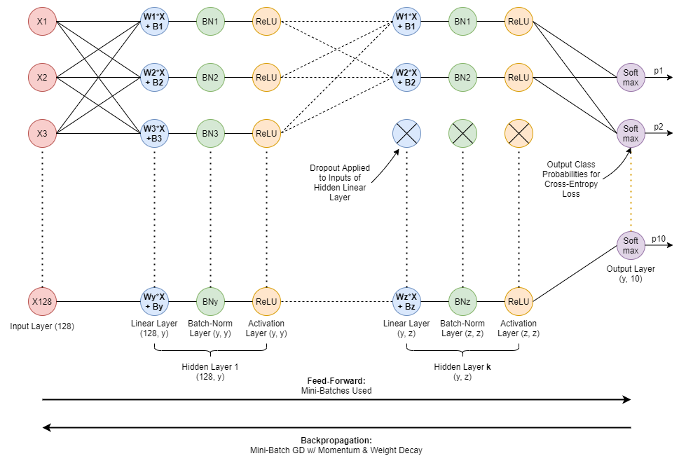

# comp5329-assignment1

Welcome to our assignment, we made it our goal to have a clear OOP setup for our implemention of the MLP.
 
For experimentation, we have implemented YAML files to change configurations.

The general model design can be seen below (for the assumed 128-input and 10-output dimensions):




## Dependencies

Python Version: `python=3.8`

Dependencies are stored in `requirements.txt`. 

If you install new packages please use `pip list --format freeze > requirements.txt` to replace the file.

Code is auto-formatted using `black`: installation instructions for IDEs: https://black.readthedocs.io/en/stable/editor_integration.html

Docstrings are Google style  

## Running the code
Note that the below commands will run the best model, which corresponds to _params-best_ in _hyperparams/config.yml_. To run another model, replace _params-best_ with another model name in _hyperparams/config.yml_.

To **run the best model** on the entire training set and test on the test set, run:
```
python main.py -hy params-best
```
The above command takes ~22 minutes on a machine with 12 cores.

To create **learning curves for the best model**, run:
```
python main.py -lc 1 -hy params-best
```
To run the complete ablation studies for the best model, run:
```
python main.py -a 1 -hy params-best
```
For 5-folds stratified cross validation with the best model, run:
```
python main.py -hy params-best -kf 1 -p [number of processors to use]
```
To find the best model using a grid-search with 5-folds cross validation, run:
```
python main.py -hy grid-search1 -kf 1 -p [number of processors to use]
```
where _grid-search1_ represents the hyperparameter values to search over, defined in _hyperparams/config.yml_.

To plot the best model train and validation errors with respect to the number of epochs, run:
```
python main.py -kf 1 -pe 1 -hy params-best
```
To generate a model performance table after a (set of) grid search, run:
```
python analysis/hyperparam_plots.py -rf [set of results files]
```
where [set of results files] can be one or more grid search result json files from _results/_.

## Folder Structure

```
ROOT/
├── hyperparams/ - YAML files for our experiment config
│ └── config.yml
├── main.py - main file for running our experiments
├── requirements.txt - requirements for our project
└── src/ - source code for our MLP implementation
    ├── activation/ - directory for our activations
    │ ├── activation.py - base case for activation
    │ ├── leaky_relu.py - leaky ReLU activation function
    │ ├── logistic.py - logistic activation function
    │ ├── relu.py - ReLU activation function
    │ └── tanh.py - tanh activation function
    ├── layers/ - directory for our layers
    │ ├── layer.py - base class for layers
    │ ├── batch_norm.py - BatchNorm layer
    │ └── linear.py - Linear layer
    ├── loss/ - directory for our loss functions
    │ ├── loss.py - base class for loss functions
    │ ├── cross_entropy.py - cross entropy loss
    │ └── mean_square_error.py - MSE loss
    ├── network/ - directory for our NN
    │ └── mlp.py - MLP class
    ├── optimiser/ - directory for our optimisers
    │ ├── optimiser.py - base class for optimisers
    │ ├── adagrad.py - AgaGrad optimiser
    │ ├── adam.py - ADAM optimiser
    │ ├── adadelta.py - AdaDelta optimiser
    │ └── sgd.py - SGD optimiser (handles momentum interally)
    ├── trainer/ - directory for our Trainer object
    │ └── trainer.py
    └── utils/ - misc utils 
        ├── calculations.py - mainly mathematical computations
        ├── helpers.py - object initialisers
        ├── io.py - input output
        ├── metrics.py - ML metrics 
        └── ml.py - other ML related tasks

  ```

  